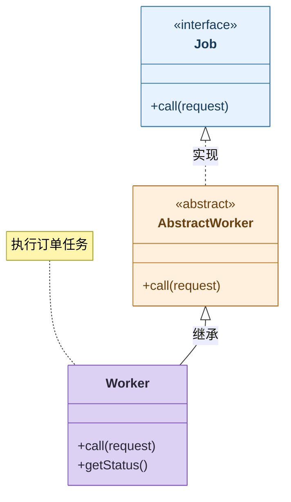
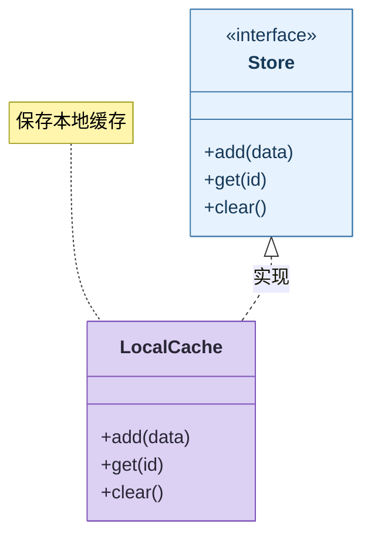

# 订单处理类图

## 1. 执行模块

```mermaid
classDiagram
    direction TB
    class Job {
        <<interface>>
        +call(request)
    }
    class AbstractWorker {
        <<abstract>>
        +call(request)
    }
    class Worker {
        +call(request)
        +getStatus()
    }
    Job <|.. AbstractWorker : 实现
    AbstractWorker <|-- Worker : 继承
    note for Worker "执行订单任务"
    style Job fill:#E7F2FF,stroke:#3D78A8,color:#173A58
    style AbstractWorker fill:#FFF0DD,stroke:#B67526,color:#694011
    style Worker fill:#DCD0F3,stroke:#8055BA,color:#292735
```

## 2. 缓存模块

```mermaid
classDiagram
    direction TB
    class Store {
        <<interface>>
        +add(data)
        +get(id)
        +clear()
    }
    class LocalCache {
        +add(data)
        +get(id)
        +clear()
    }
    Store <|.. LocalCache : 实现
    note for LocalCache "保存本地缓存"
    style Store fill:#E7F2FF,stroke:#3D78A8,color:#173A58
    style LocalCache fill:#DCD0F3,stroke:#8055BA,color:#292735
```
