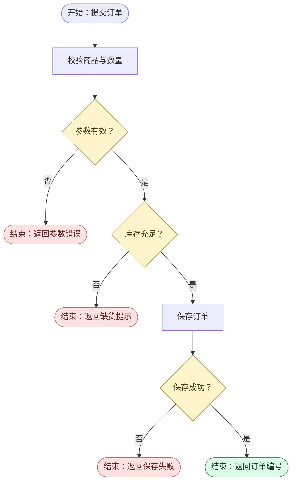
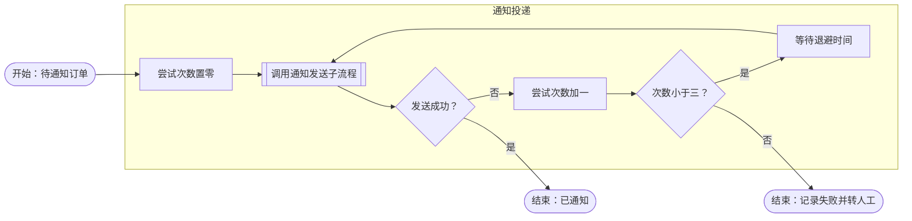

# 订单流程示例

以下是概念设计，仅演示流程图的判断、回边和子流程，不代表某个项目已实现的行为。库存并发、支付幂等和取消处理未纳入本示例。

## 提交订单：校验与失败分支

```mermaid
flowchart TB
    Start(["开始：提交订单"]) --> Validate["校验商品与数量"]
    Validate --> Valid{"参数有效？"}
    Valid -->|否| Invalid(["结束：返回参数错误"])
    Valid -->|是| Stock{"库存充足？"}
    Stock -->|否| Unavailable(["结束：返回缺货提示"])
    Stock -->|是| Save["保存订单"]
    Save --> Saved{"保存成功？"}
    Saved -->|否| Failed(["结束：返回保存失败"])
    Saved -->|是| Success(["结束：返回订单编号"])
    classDef success fill:#dcfce7,stroke:#42815a,color:#173a25
    classDef failure fill:#fee2e2,stroke:#b86a6a,color:#622525
    classDef decision fill:#fff4cc,stroke:#ae9342,color:#443912
    class Success success
    class Invalid,Unavailable,Failed failure
    class Valid,Stock,Saved decision
```

## 通知投递：有界重试与子流程

```mermaid
flowchart LR
    Start(["开始：待通知订单"]) --> Init["尝试次数置零"]
    subgraph Delivery["通知投递"]
        Init --> Send[["调用通知发送子流程"]]
        Send --> Sent{"发送成功？"}
        Sent -->|否| Count["尝试次数加一"]
        Count --> Retry{"次数小于三？"}
        Retry -->|是| Wait["等待退避时间"]
        Wait --> Send
    end
    Sent -->|是| Done(["结束：已通知"])
    Retry -->|否| Manual(["结束：记录失败并转人工"])
```
