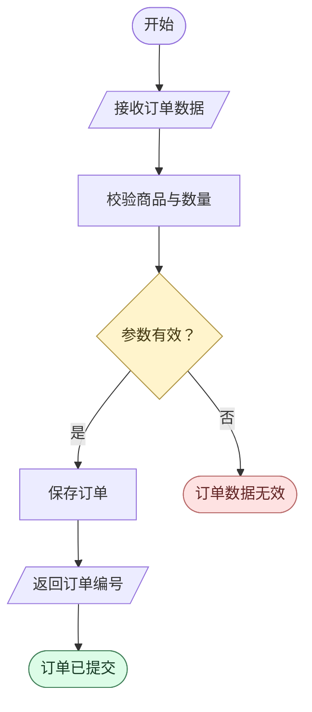
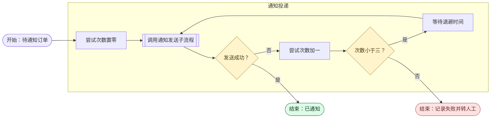

# 基础流程图模板

复制此文件，保留需要的 Mermaid 图块，再替换标题、动作、分支条件和结果。第一个图块适合单入口的业务流程，第二个可用于有退出条件的重试。订单与通知场景均为概念示例。

## 提交订单：校验与失败分支

```mermaid
flowchart TB
    Start(["开始"]) --> Input[/"接收订单数据"/]
    Input --> Validate["校验商品与数量"]
    Validate --> Valid{"参数有效？"}
    Valid -->|是| Save["保存订单"]
    Valid -->|否| Invalid(["订单数据无效"])
    Save --> Output[/"返回订单编号"/]
    Output --> Success(["订单已提交"])
    classDef success fill:#dcfce7,stroke:#42815a,color:#173a25
    classDef failure fill:#fee2e2,stroke:#b86a6a,color:#622525
    classDef decision fill:#fff4cc,stroke:#ae9342,color:#443912
    class Success success
    class Invalid failure
    class Valid decision
```

## 通知投递：有界重试与子流程

```mermaid
flowchart LR
    Start(["开始：待通知订单"]) --> Init["尝试次数置零"]
    subgraph Delivery["通知投递"]
        Init --> Send[["调用通知发送子流程"]]
        Send --> Sent{"发送成功？"}
        Sent -->|否| Count["尝试次数加一"]
        Count --> Retry{"次数小于三？"}
        Retry -->|是| Wait["等待退避时间"]
        Wait --> Send
    end
    Sent -->|是| Done(["结束：已通知"])
    Retry -->|否| Manual(["结束：记录失败并转人工"])
    classDef success fill:#dcfce7,stroke:#42815a,color:#173a25
    classDef failure fill:#fee2e2,stroke:#b86a6a,color:#622525
    classDef decision fill:#fff4cc,stroke:#ae9342,color:#443912
    class Done success
    class Manual failure
    class Sent,Retry decision
```
