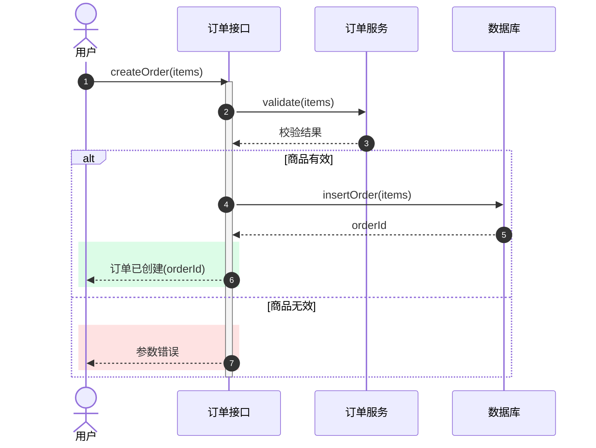
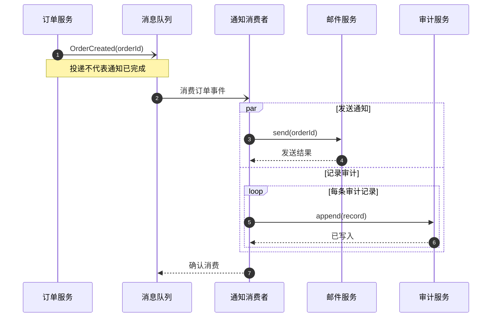

# 订单交互示例

以下是概念设计，不代表某个项目已实现的行为。仅演示消息语义与控制结构；生产系统还需处理超时、取消和幂等。

## 创建订单：校验与返回

```mermaid
sequenceDiagram
    autonumber
    actor User as 用户
    participant API as 订单接口
    participant Service as 订单服务
    participant DB as 数据库
    User->>API: createOrder(items)
    activate API
    API->>Service: validate(items)
    Service-->>API: 校验结果
    alt 商品有效
        API->>DB: insertOrder(items)
        DB-->>API: orderId
        rect rgb(220, 252, 231)
            API-->>User: 订单已创建(orderId)
        end
    else 商品无效
        rect rgb(254, 226, 226)
            API-->>User: 参数错误
        end
    end
    deactivate API
```

## 异步通知：投递与并行处理

```mermaid
sequenceDiagram
    autonumber
    participant Service as 订单服务
    participant Queue as 消息队列
    participant Worker as 通知消费者
    participant Email as 邮件服务
    participant Audit as 审计服务
    Service-)Queue: OrderCreated(orderId)
    Note over Service,Queue: 投递不代表通知已完成
    Queue-)Worker: 消费订单事件
    par 发送通知
        Worker->>Email: send(orderId)
        Email-->>Worker: 发送结果
    and 记录审计
        loop 每条审计记录
            Worker->>Audit: append(record)
            Audit-->>Worker: 已写入
        end
    end
    Worker-->>Queue: 确认消费
```
